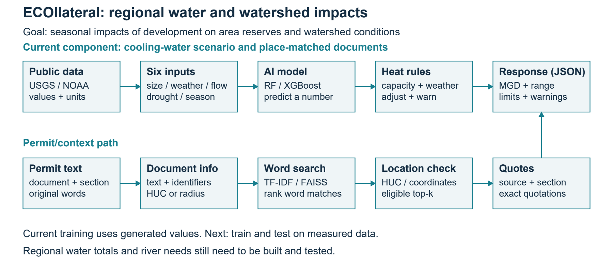

# ECOllateral: mid-semester project review

CSCI 4150 A2 | Shaun, Troy, Scott | Evidence snapshot: October 7, 2026

## 1. What problem are we solving?

**Main question:** Given proposed development demands, cooling requirements, and location, how could municipal water reserves and watershed conditions in the surrounding area change across seasons?

ECOllateral is an environmental impact assessment and regional ecosystem forecasting project for municipal planners, environmental researchers, and utilities. The area and ecosystem are the focus. The intended assessment combines seasonal conditions, development pressures, supply/reserves, other demands, returns, and ecological flow needs. Cooling water is one pressure input, not the whole assessment.

**Current demonstration:** a user enters IT capacity in megawatts (MW), cooling type, an eight-digit watershed code (HUC8), and a month. The component returns on-site consumption in million US gallons per day (MGD), physical limits, a prediction range, warnings, and location-matched quotations. It does not yet return a validated regional impact score.

**What works now:** downloading public environmental data, converting units, building monthly inputs, using separate models for three cooling types, checking physical limits, finding permit sections for a location, a FastAPI interface, a typed TypeScript client, and a repeatable notebook for missing-data tests. The API is the interface another program uses to request a forecast. There are 51 passing local tests. The example request loads saved model files and returns HTTP 200, with warnings that the data are made up.

**What the evidence does not show yet:** facility targets and research river data are synthetic. Two days of real USGS/NOAA data test downloading/parsing, not accuracy. Fictional permits test search rules, not compliance. `predicted_collateral_stress_mgd` means on-site consumption. Regional balances, ecological thresholds, recharge inference, and area-wide stress prediction remain unimplemented or unvalidated.

## What can we finish for this review?

The software milestone is a repeatable component prototype. A2 reviews its map, comparisons, limits, and decisions within the regional goal. Next we need measured development demand and area conditions, verified boundaries, real documents, regional targets, and independent range tests.

Full details remain in `../../implementation-notes.md`, `../../data-contracts.md`, and `../../validation-results.md`. `../../project-scope.md` separates the regional goal from current features. Results in `../evidence/` have fingerprints in `../evidence/manifest.json` and refer to implementation commit `125aa40`. For rehearsal, use `../presentation-script.md`.

<!-- pagebreak -->

## 2. How does the system work?

The map shows reusable components already built. The regional reserve/stress assessment is planned. Cooling limits cannot stand in for ecological thresholds.

**Number path:** six inputs describe facility size, ordinary air temperature (dry bulb), evaporative-cooling temperature (wet bulb), river flow, drought score (PDSI), and season. The training target is water consumption in MGD. Decision-tree models learn how those inputs relate to water use, including relationships that are not straight lines. Engineering rules calculate the allowed range.

**Permit path:** each section keeps its words, document/section identifiers, source, and location. TF-IDF turns informative words and word pairs into numeric vectors. FAISS searches those vectors for word matches. The system checks watershed or coordinate-radius eligibility before keeping the best k results, called top-k.

**How the paths meet:** the model predicts a number; separate rules move an out-of-range prediction to the nearest physical limit and show a warning. The response combines the number with exact permit quotations. The text is extractive: it uses existing source text. No generative LLM calculates the result or makes a legal compliance decision.

Training uses dates in time order: oldest 60% for training, next 20% for model choice and prediction-range sizing, newest 20% for testing. Missing flow and PDSI are filled from training statistics only. Using the middle group for two jobs is a limitation discussed in Section 6.

A HUC matches a watershed code; it does not give a distance. A request with only a HUC cannot use a river gauge's coordinates as the facility's coordinates to match a radius-based permit. Groundwater depth stays in meters; converting it to MGD would require a separate physical model.

<!-- pagebreak -->

## 3. E1: Which AI model made smaller errors?

**Idea tested:** can models learn the made-up cooling-water pattern from the six inputs? We compared RandomForest (RF), which combines decision trees, and XGBoost (XGB), which adds trees to improve earlier errors. Each cooling type has its own comparison and model.

**How we tested:** 1,600 synthetic rows per cooling type across six years; random seed 42; dates grouped in time order. Both models use the same inputs and fill missing values from training data only. We choose using RMSE on the middle date group, then evaluate on dates saved for testing. RMSE gives large errors extra weight. MAE is the average error size; lower is better. R2 measures fit, not the probability a prediction is right.

| Cooling type | RF test MAE (MGD) | XGB test MAE (MGD) | Selected model |
| --- | --- | --- | --- |
| Cooling tower | 0.004890 | 0.003668 | XGBoost |
| Direct evaporative | 0.003842 | 0.003191 | XGBoost |
| Dry air-cooled | 0.000000 | 0.000000 | RandomForest, tied |

The two evaporative test groups each have 333 rows. Selected R2 is 0.99808 for towers and 0.99728 for direct evaporation. The benchmark goal is R2 > 0.80 and MAE < 0.05 MGD. These are prototype goals, not engineering approval criteria. Dry air cooling has a constant zero on-site water target, so R2 is undefined and we do not mark its combined benchmark goal as met.

**Decision: Adopt - keep this approach.** Use XGBoost for both evaporative types and retain RandomForest for comparison. Continue choosing separately for each cooling type. Keep the zero-water boundary for dry air cooling within our stated on-site scope.

**Limit:** high scores show that the models learned generated targets. They do not prove accuracy at real facilities or in a new watershed. Cooling types are modeled separately; they are not a fourth independent experiment. Next we need measured water use and tests that reserve whole facilities the model has never seen.

**Evidence:** `../evidence/regression-comparison.csv`, `../evidence/benchmark.json`; code `src/models/regression.py`. The report keeps calibration RMSE so we can check why each model was chosen.

<!-- pagebreak -->

## 4. E2: What happens when drought data are missing?

**Idea tested:** after filling randomly missing drought readings, do forecasts stay within 0.05 MGD of the prediction made with complete data?

**How we tested:** 365 synthetic dates, including 121 drought dates where PDSI <= -2. Remove 10%, 25%, or 40% of drought readings, with 50 repeats per method. Spatial filling borrows from the nearest station with a reading on that day. Linear time filling draws a straight line between readings around a gap. The fitted water-use model stays fixed. Sensitivity bands show changes caused by missing data; they are not prediction intervals for future water use.

| Missing rate | Spatial variance (MGD2) | Linear variance (MGD2) | Within +/-0.05 MGD |
| --- | --- | --- | --- |
| 10% | 3.29e-9 | 6.00e-9 | 100%, both |
| 25% | 6.31e-9 | 2.21e-8 | 100%, both |
| 40% | 9.05e-9 | 4.09e-8 | 100%, both |

Variance measures how much predictions change between repeats; smaller values mean less change. Similar made-up neighboring stations make this test easy.

**Important weakness:** a separate diagnostic adds 100 MGD to neighboring stations' flow. With 40% gaps and 20 repeats, spatial tolerance coverage falls to 60.33%; linear coverage is 98.60%. This uses `prediction = 0.01 * streamflow`, not the fitted AI model. It shows the danger of biased neighbors, not the production model's failure rate. Both methods fail the stricter rule requiring every drought-date 90% change band to stay within tolerance.

**Decision: Modify - keep the methods, improve the checks.** Check whether nearby stations have similar river behavior. Test long gaps and outages affecting multiple stations together. Linear filling can use later readings, so a live forecast needs a method that uses only data available at that time. Groundwater filling is tested separately in meters.

**Evidence:** `../evidence/missingness-summary.csv`, `../evidence/biased-donor-diagnostic.csv`, `../evidence/missingness-sensitivity.png`, `../evidence/missingness-band90.png`, and `../evidence/groundwater-reconstruction.csv`.

<!-- pagebreak -->

## 5. E3 and E4: Do the safeguards work?

### E3: stop impossible water-use estimates

**Idea tested:** a faulty model, or one predicting outside familiar conditions, should not quietly return an impossible number. Rules estimate the heat to remove and the water needed for evaporation. Inputs include capacity, utilization, PUE, and outside temperatures. Utilization is the assumed share of IT load in use. PUE is total facility power divided by IT power.

A 40 MW case with 30 C dry bulb and 20 C wet bulb gives limits of 0 to 0.446484 MGD. We deliberately force predictions of -1 and 1,000,000 MGD. The system moves them to 0 and 0.446484 MGD and adds `constraint_violation`. These are injected test values, not errors observed from the fitted model. The test proves the limit and warning behavior.

**Decision: Adopt - keep the separate rules.** Preserve the raw number, the adjusted number, and the warning. Default PUE 1.2, utilization 1.0, and heat-removal choices are adjustable engineering assumptions. They are not universal ASHRAE limits or an account of every facility water use.

**Evidence:** `../evidence/constraint-failure-cases.json`; `src/rules/thermodynamic.py` and `src/models/regression.py`.

### E4: match permit words and location

**Idea tested:** matching words is not enough; a permit must also match the request's location. Normalized TF-IDF vectors use single words and word pairs. FAISS ranks them using inner-product similarity. The location check happens before selecting top-k.

Four made-up document cases show: a matching HUC returns `local-huc`; a wrong HUC returns nothing; HUC-only input excludes a permit marked only with coordinates; actual matching coordinates include it. Results preserve the original excerpt and section identifiers.

**Decision: Adopt - keep the word search and location checks.** Preserve source/location information and exact quotations so a person can review them. Before adding more documents, test real permits reviewed by people. Measure precision (returned sections that are relevant) and recall (relevant sections found). TF-IDF matches words; it does not prove deep understanding or legal applicability.

**Evidence:** `../evidence/retrieval-cases.json`, `src/grounding/store.py`, and `src/grounding/generator.py`.

<!-- pagebreak -->

## 6. E5: Did the prediction ranges meet the target?

**Idea tested:** ranges intended to include 90% of values should reach about 90% on test data. Coverage is the share of test values inside the range. Model fit (R2) and range coverage are different measures.

| Selected model | Test R2 | Target coverage | Actual coverage |
| --- | --- | --- | --- |
| Cooling tower XGB | 0.99808 | 90% | 88.29% (294/333) |
| Direct evaporative XGB | 0.99728 | 90% | 87.99% (293/333) |

Both results miss the prototype check of observed coverage >=90%. These are finite synthetic samples, and no significance test was run. The shortfall alone does not prove a statistically significant calibration failure. Still, good fit does not justify claiming that 90% coverage has been verified.

**Implementation weakness:** the same middle date group selects RF versus XGBoost and sets the range width from earlier errors. Choosing a model can affect those errors. Data in time order can also break the assumption that calibration and test examples are comparable, called exchangeability. We do not claim a separately validated conformal coverage guarantee.

**Decision: Modify - separate the jobs.** Use separate data for tuning/model selection, range calibration, and final testing. Check coverage by time, drought condition, cooling type, and unseen facility. Report test counts, range width, and uncertainty in the coverage estimate. Check again after physical clipping and on data different from the generated targets.

**Decision: Reject - avoid unsupported claims.** R2 is not a confidence probability. On-site consumption is not a validated measure of a town's water stress.

**Working example:** `../evidence/forecast-request.json` and `../evidence/forecast.json` show a 40 MW tower request returning about 0.204339 MGD, a citation, and warnings about synthetic and historical inputs. It proves the API works, not accuracy on independent measurements.

**Evidence:** `../evidence/interval-coverage.csv`, `../evidence/benchmark.json`, `src/models/regression.py`. The dry air-cooled zero-target case has 100% coverage and zero range width; it is excluded from the meaningful evaporative comparison.

<!-- pagebreak -->

## 7. What do we keep, change, and test next?

| Decision | Evidence | What it means |
| --- | --- | --- |
| Adopt models and physical limits | E1, E3 | Keep the successful synthetic comparison and separate number checks |
| Adopt word search plus location | E4 | Keep sources and eligible quotations; test real permits next |
| Modify missing-data and range tests | E2, E5 | Test biased/shared outages, live filling, and separate calibration |
| Reject R2-as-confidence and town-stress claims | E1, E5, output scope | Explain fit, range coverage, and on-site consumption separately |
| Defer neural and generative LLM models | No comparison run | Focus first on measured water use and checked sources |

**Next question:** can observed area conditions and development demands support an accurate seasonal assessment of reserves and watershed stress in an unseen area? The cooling component also needs unseen-facility tests as a supporting task.

**Plan and owners:** Shaun leads coding, area-assessment integration, regional targets, separate calibration, and area/facility holdouts. Troy checks station/HUC/climate-division matches, observed supply/demand and ecological baselines, drought gaps, and document grounding. Scott supports safety/interface review, failure analysis, regional documents, human-reviewed relevance checks, and evidence. Compare RF/XGB; report MAE, RMSE, R2, coverage, range width, clipping frequency, missing-data warnings, and search precision/recall for the actual target.

**Scope decision: Modify.** Put regional conditions and cumulative pressures at the center. Add supply/reserve balances, returns, ecological flow needs, and verified boundaries before claiming regional stress. E1-E5 remain component evidence. A zero-shot LLM benchmark, dense embeddings, historical heatwave study, and 2015-2022 recharge analysis remain unperformed/planned.

**Pass/fail checks:** predictions stay within calculated limits and expose clipped values; bad input and missing model files return controlled API errors; accuracy meets the stated benchmark goal; range coverage meets the agreed target on genuinely unused test data; missing-data changes meet tolerance, including band checks; search never returns an ineligible location. Real-world thresholds still need team/instructor review before deployment claims.

**Class AI connections:** symbolic rules store domain knowledge; supervised trees learn from numeric inputs and targets; vector search turns document words into numbers; interpolation fills missing observations; uncertainty tests check whether predicted ranges are useful. The key design issue is how these pieces work together. Specific studio names/links still need confirmation because they were not supplied. No neural or generative LLM experiment is claimed.

<!-- pagebreak -->

## 8. Team, data sources, and remaining course steps

**Shaun:** primary coding contributor; leads data downloading, rules, model/API integration, and the typed client.

**Troy:** assigned environmental acquisition/area mapping, drought and groundwater interpretation, document grounding, and test limits.

**Scott:** assigned safety/interface evaluation, regional document review, failure analysis, diagrams/slides, rehearsal, and instructor-access checks.

The user confirmed Shaun's coding lead. Troy's and Scott's lines assign work; they do not certify completion. Each member must confirm actual completed contributions before submitting the one-line statements. Proposed speaking order: Shaun slides 1-3, Troy 4-5, Scott 6.

**Where the data come from:** USGS continuous observations, NOAA GSOD weather, and NOAA monthly climate-division PDSI. The July 1-2, 2024 download/parsing example uses USGS-01646500 (HUC8 02070008), NOAA station 72403093738, and climate division 4401. The division's location match is unverified. This example is separate from the synthetic HUC 02070010 API scenario. USGS/NOAA publish public data; third-party and permit-source rights still need checking. Exact endpoints and official rights references remain in `data-governance.md`.

Preparing this package has not performed a survey, obtained IRB or instructor scraping approval, booked office hours, changed GitHub permissions, or submitted coursework.

**Prepared files:** dossier, system map, evidence/decision table, editable slides and PDF, four-minute script/Q&A, team statement, and full project checkoff. The manifest records file fingerprints and experiment origins. `../../../scripts/a2/collect_evidence.py` refreshes local evidence; `../../../scripts/a2/build_materials.py` rebuilds document exports. Edit the presentation directly in the PowerPoint file.

**Still to confirm:** October 20 or 23, 2026 presentation assignment, exact Submitty deadline, instructor/TA repository access, office hours, rehearsal, actual contributions, and studio links. The course handouts state requirements; they do not authorize messages, uploads, or access changes.

**Repository:** https://github.com/ScottLiu12/ECOllateral. The local remote URL is verified; collaborator access and whether this local snapshot has been pushed are unverified. GitHub credentials are not needed to prepare the local package.
